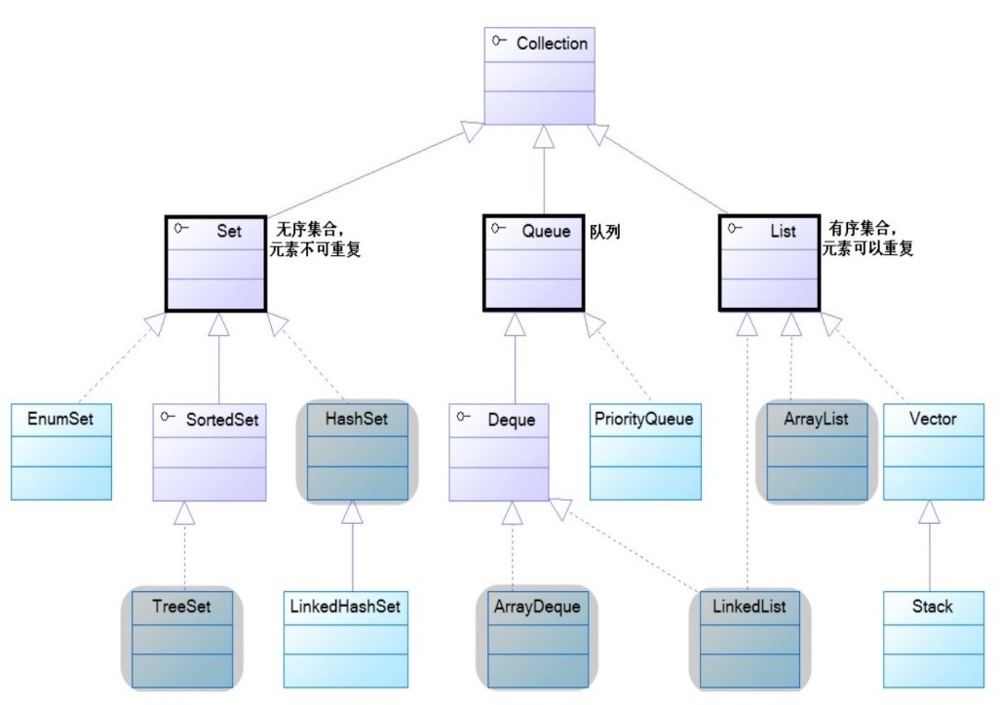
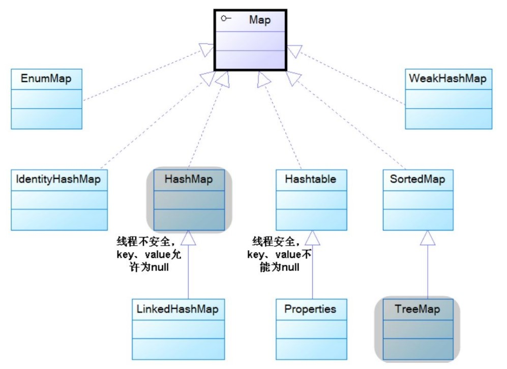
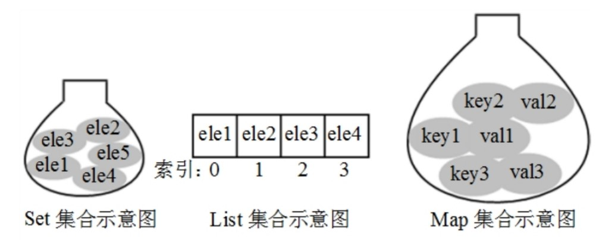

### 第8章 Java集合

Java集合类——工具类

1. 存储数量不等的对象
2. 实现常用的数据结构
3. 保存具有映射关系的关联数组

四种体系：

- Set：无序、不可重复的集合
- List：有序、重复的集合
- Map：具有映射关系的集合
- Queue：一种队列集合实现（Java 5加入）

> 在Java 5之前，Java集合会丢失容器中所有对象的数据类型，把所有对象都当成Object类型处理；从Java 5增加了泛型以后，Java集合可以记住容器中对象的数据类型，从而可以编写出更简洁、健壮的代码。


#### 8.1 Java集合概述

集合类目的：

为了保存数量不确定的数据，以及保存具有映射关系的数据（也 被称为关联数组），也称为**容器类**。

> 所有的集合类都位于 **java.util** 包下，后来为了处理多线程环境下的并发安全问题，Java 5 还在 java.util.concurrent 包下提供了一些多线程支持的集合类。

**数组元素既可以是基本类型的值，也可以是对象（引用变量）；而集合里只能保存对象（引用变量）。然而Java支持自动装箱，将基本数据类型封装为对象，即可直接用以保存基本数据。**

集合类主要由两个接口派生而出：**Collection**和**Map**， Collection和Map是Java集合框架的根接口，这两个接口又包含了一些子接口或实现类。如下图8.1.1和8.1.2。



*图8.1.1 Collection集合体系的继承树*



*图8.1.2 Map体系的继承树*

Map保存的每项数据都是 key-value 对，也就是由key和value两个值组成。

> e.g. 成绩单：语文—79，数学—80，每项成绩都由两个值组成，即科目名和成绩。对于一张成绩表而言，科目通常不会重复，而成绩是可重复的， 通常习惯根据科目来查阅成绩，而不会根据成绩来查阅科目。

Map里的key是不可重复的，key用于标识集合里的每项数据，如果需要查阅Map中的数据时，总是根据Map的key来获取。

可以把Java所有集合分成三大类，其中Set集合类似于一个罐子，把一个对象添加到Set集合时，Set集合无法记住添加这个元素的顺序，所以Set里的元素不能重复（否则系统无法准确识别这个元素）；List集合非常像一个数组，它可以记住每次添加元素的顺序、且List的长度可变。Map集合也像一个罐子，只是它里面的每项数据都由两个值组成。（Queue为特殊的List）。如下图8.1.3。



如果访问List集合中的元素，可以直接根据元素的索引来访问；如果访问Map集合中的元素，可以根据每项元素的key来访问其value；如果访问Set集合中的元素，则只能根据元素本身来访问（这也是Set集合里元素不允许重复的原因）。

常用实现类：

HashSet 、TreeSet 、ArrayList 、ArrayDeque 、LinkedList 和 HashMap 、TreeMap 等实现类。


#### 8.2 Java 11增强的Collection和Iterator接口

Collection接口是List、Set和Queue接口的父接口，定义了如下操作集合元素的方法：

- `boolean add(Object o)`：该方法用于向集合里添加一个元素。如果集合对象被添加操作改变了，则返回true。
- `boolean addAll(Collection c)`：该方法把集合c里的所有元素添加到指定集合里。如果集合对象被添加操作改变了，则返回true。
- `void clear()`：清除集合里的所有元素，将集合长度变为0。
- `boolean contains(Object o)`：返回集合里是否包含指定元素。
- `boolean containsAll(Collection c)`：返回集合里是否包含集合c里的所有元素。
- `boolean isEmpty()`：返回集合是否为空。当集合长度为0时返回true，否则返回false。
- `Iterator iterator()`：返回一个Iterator对象，用于遍历集合里的元素。
- `boolean remove(Object o)`：删除集合中的指定元素o，当集合中包含了一个或多个元素o时，该方法只删除第一个符合条件的元素，该方法将返回true。
- `boolean removeAll(Collection c)`：从集合中删除集合c里包含的所有元素（相当于用调用该方法的集合减集合c），如果删除了一个或一个以上的元素，则该方法返回true。
- `boolean retainAll(Collection c)`：从集合中删除集合c里不包含的元素（相当于把调用该方法的集合变成该集合和集合c的交集），如果该操作改变了调用该方法的集合，则该方法返回 true。
- `int size()`：该方法返回集合里元素的个数。
- `Object[] toArray()`：该方法把集合转换成一个数组，所有的 集合元素变成对应的数组元素。


**示例代码**

```java
public class CollectionTest
{
	public static void main(String[] args)
	{
		var c = new ArrayList();
		// 添加元素
		c.add("孙悟空");
		// 虽然集合里不能放基本类型的值，但Java支持自动装箱
		c.add(6);
		System.out.println("c集合的元素个数为:" + c.size()); // 输出2
		// 删除指定元素
		c.remove(6);
		System.out.println("c集合的元素个数为:" + c.size()); // 输出1
		// 判断是否包含指定字符串
		System.out.println("c集合的是否包含\"孙悟空\"字符串:"
			+ c.contains("孙悟空")); // 输出true
		c.add("轻量级Java EE企业应用实战");
		System.out.println("c集合的元素：" + c);
		var books = new HashSet();
		books.add("轻量级Java EE企业应用实战");
		books.add("疯狂Java讲义");
		System.out.println("c集合是否完全包含books集合？"
			+ c.containsAll(books)); // 输出false
		// 用c集合减去books集合里的元素
		c.removeAll(books);
		System.out.println("c集合的元素：" + c);
		// 删除c集合里所有元素
		c.clear();
		System.out.println("c集合的元素：" + c);
		// 控制books集合里只剩下c集合里也包含的元素
		books.retainAll(c);
		System.out.println("books集合的元素:" + books);
	}
    // 系统可能输出一些警告（warning）提示，这些警告提醒用户没有使用泛型（Generic）来限制集合里的元素类型
}
```

运行结果为：

> c集合的元素个数为：2
>
> c集合的元素个数为：1
>
> c集合是否包含“孙悟空”字符串：true
>
> c集合的元素：[孙悟空，轻量级Java EE企业应用实战]
>
> c集合是否完全包含books集合？false
>
> c集合的元素：[孙悟空]
>
> c集合的元素：[]
>
> books集合的元素：[]

可以看出Collection的用法有：**添加元素**、**删除元素**、返回Collection集合的**元素个数**以及**清空整个集合**等。

当使用System.out的println()方法来输出集合对象时，将输出[ele1，ele2，...]的形式，这显然是因为所有的Collection实现类都重写了**toString()**方法，该方法可以一次性地输出集合中的所有元素。


**遍历集合元素**

> 注意：在传统模式下，把一个对象“丢进”集合中后，集合会忘记这个对象的类型——也就是说，系统把所有的集合元素都当成Object类型。从JDK 1.5以后，这种状态得到了改进：可以使用泛型来限制集合里元素的类型，并让集合记住所有集合元素的类型。

- `Object[] toArray()`：传统的返回数组的方法。
- `T[] toArray(IntFunction)`：（Java 11新增）利用泛型，返回特定类型的方法。

```java
// 该Collection使用了泛型，指定它的集合元素都是String
var strColl = List.of("Java", "Kotlin", "Swift", "Python");
// toArray()方法参数是一个Lambda表达式，代表IntFunction对象
// 此时toArray()方法的返回值是String[]，而不是Object[]
String[] sa = strColl.toArray(String[]::new);
System.out.println(Arrays.toString(sa));
```

由于使用该方法的主要目的就是利用泛型，因此toArray(IntFunction)方法参数通常就是它要返回的数组类型后面加双冒号和new（构造器引用）。


##### 8.2.1 使用Lambda表达式遍历集合

- `void forEach(Consumer action)`

（Java 8为Iterable接口新增）参数的类型是一个函数式接口，由于Iterable接口是Collection接口的父接口，因此Collection集合也可直接调用该方法。

当程序调用Iterable的forEach(Consumer action)遍历集合元素时，程序会依次将集合元素传给Consumer的accept(T t)方法（该接口中唯一的抽象方法）。正因为Consumer是函数式接口，因此可以使用Lambda表达式来遍历集合元素。

```java
public class CollectionEach
{
	public static void main(String[] args)
	{
		// 创建一个集合
		var books = new HashSet();
		books.add("轻量级Java EE企业应用实战");
		books.add("疯狂Java讲义");
		books.add("疯狂Android讲义");
		// 调用forEach()方法遍历集合
		books.forEach(obj -> System.out.println("迭代集合元素：" + obj));
	}
}
```

上面程序调用了Iterable的forEach()默认方法来遍历集合元素，传给该方法的参数是一个Lambda表达式，该Lambda表达式的目标类型是Consumer。forEach()方法会自动将集合元素逐个地传给Lambda表达式的形参，这样Lambda表达式的代码体即可遍历到集合元素了。


##### 8.2.2 使用Iterator遍历集合元素

Collection系列集合、Map系列集合主要用于盛装其他对象，而Iterator则主要用于遍历（即迭代访问）Collection集合中的元素，Iterator对象也被称为迭代器。

- `boolean hasNext()`：如果被迭代的集合元素还没有被遍历完，则返回true。
- `Object next()`：返回集合里的下一个元素。
- `void remove()`：删除集合里上一次next方法返回的元素。
- `void forEachRemaining(Consumer action)`，这是Java 8为Iterator新增的默认方法，该方法可使用Lambda表达式来遍历集合元素。


**示例代码**

```java
public class IteratorTest
{
	public static void main(String[] args)
	{
		// 创建集合、添加元素的代码与前一个程序相同
		var books = new HashSet();
		books.add("轻量级Java EE企业应用实战");
		books.add("疯狂Java讲义");
		books.add("疯狂Android讲义");
		// 获取books集合对应的迭代器
		var it = books.iterator();
		while(it.hasNext())
		{
			// it.next()方法返回的数据类型是Object类型，因此需要强制类型转换
			String book = (String)it.next();
			System.out.println(book);
			if (book.equals("疯狂Java讲义"))
			{
				// 从集合中删除上一次next方法返回的元素
				it.remove();
			}
			// 对book变量赋值，不会改变集合元素本身
			book = "测试字符串";   //①
		}
		System.out.println(books);
	}
}
```

**Iterator仅用于遍历集合，Iterator本身并不提供盛装对象的能力。如果需要创建Iterator对象，则必须有一个被迭代的集合。**

上面程序中①号代码对迭代变量book进行赋值，但当再次输出books集合时，会看到集合里的元素没有任何改变。这就可以得到一个结论：**当使用Iterator对集合元素进行迭代时，Iterator并不是 把集合元素本身传给了迭代变量，而是把集合元素的值传给了迭代变量**，所以修改迭代变量的值对集合元素本身没有任何影响。（而remove()方法可以改变集合）


当使用Iterator迭代访问集合元素时，集合里的元素不能被改变，只有通过Iterator的remove()方法删除上一次next()方法返回的集合元素才可以改变；否则将会引发`java.util.Concurrent ModificationException`异常。

**示例代码**

```java
public class IteratorErrorTest
{
	public static void main(String[] args)
	{
		// 创建集合、添加元素的代码与前一个程序相同
		var books = new HashSet();
		books.add("轻量级Java EE企业应用实战");
		books.add("疯狂Java讲义");
		books.add("疯狂Android讲义");
		// 获取books集合对应的迭代器
		var it = books.iterator();
		while(it.hasNext())
		{
			var book = (String)it.next();
			System.out.println(book);
			if (book.equals("疯狂Android讲义"))
			{
				// 使用Iterator迭代过程中，不可修改集合元素,下面代码引发异常
				books.remove(book);
			}
		}
	}
}
```

Iterator迭代器采用的是**快速失败（fail-fast）机制**，一旦在迭代过程中检测到该集合已经被修改（通常是程序中的其他线程修改），程序立即引发`ConcurrentModificationException`异常，而不是显示修改后的结果，这样可以避免共享资源而引发的潜在问题。

> 注意：上面程序如果改为删除“疯狂Java讲义”字符串，则不会引发异常。**但实际上这是一种危险的行为**：对于HashSet以及后面的ArrayList等，迭代时删除元素都会导致异常——只有在删除集合中的某个特定元素时才不会抛出异常，这是由集合类的实现代码决定的，程序员不应该这么做。


##### 8.2.3 使用Lambda表达式遍历Iterator

上述的`forEachRemaining(Consumer action)`方法，所需的Consumer参数同样也是函数式接口。当程序调用Iterator的`forEachRemaining(Consumer action)`遍历集合元素时，程序会依次将集合元素传给Consumer的`accept(T t)`方法（该接口中唯一的抽象方法）。

**示例代码**

```java
public class IteratorEach
{
	public static void main(String[] args)
	{
		// 创建集合、添加元素的代码与前一个程序相同
		var books = new HashSet();
		books.add("轻量级Java EE企业应用实战");
		books.add("疯狂Java讲义");
		books.add("疯狂Android讲义");
		// 获取books集合对应的迭代器
		var it = books.iterator();
		// 使用Lambda表达式（目标类型是Comsumer）来遍历集合元素
		it.forEachRemaining(obj -> System.out.println("迭代集合元素：" + obj));
	}
}
```


##### 8.2.4 使用foreach循环遍历集合元素

除可使用Iterator接口迭代访问Collection集合里的元素之外，使用Java 5提供的foreach循环迭代访问集合元素更加便捷。形如

```java
for(var obj: list)
{
    
}
```

**示例代码**

```java
public class ForeachTest
{
	public static void main(String[] args)
	{
		// 创建集合、添加元素的代码与前一个程序相同
		var books = new HashSet();
		books.add(new String("轻量级Java EE企业应用实战"));
		books.add(new String("疯狂Java讲义"));
		books.add(new String("疯狂Android讲义"));
		for (var obj : books)
		{
			// 此处的book变量也不是集合元素本身
			String book = (String)obj;
			System.out.println(book);
			if (book.equals("疯狂Android讲义"))
			{
				// 下面代码会引发ConcurrentModificationException异常
				books.remove(book);     // ①
			}
		}
		System.out.println(books);
	}
}
```

上面代码使用foreach循环来迭代访问Collection集合里的元素更加简洁，这正是JDK 1.5的foreach循环带来的优势。


##### 8.2.5 使用Predicate操作集合

- `boolean removeIf(Predicate filter)`：Java 8 为Collection集合新增的方法。会批量删除符合filter条件的所有元素。该方法需要一个Predicate（谓词）对象作为参数，Predicate也是函数式接口，因此也可使用Lambda表达式作为参数。

**示例代码**

```java
// 创建一个集合
var books = new HashSet();
books.add("轻量级Java EE企业应用实战");
books.add("疯狂Java讲义");
books.add("疯狂iOS讲义");
books.add("疯狂Ajax讲义");
books.add("疯狂Android讲义");
// 使用Lambda表达式（目标类型是Predicate）过滤集合
books.removeIf(ele -> ((String)ele).length() < 10);
System.out.println(books);
```

运行结果：

> [疯狂Android讲义, 轻量级Java EE企业应用实战]


使用Predicate可以充分简化集合的运算，假设依然有上面程序所示的books集合，如果程序有如下三个统计需求：

- 统计书名中出现“疯狂”字符串的图书数量。
- 统计书名中出现“Java”字符串的图书数量。
- 统计书名长度大于10的图书数量。

如果采用 传统的编程方式来完成这些需求，则需要执行三次循环，但采用 Predicate只需要一个方法即可。

**示例代码**

```java
public class PredicateTest2
{
	public static void main(String[] args)
	{
		// 创建books集合、为books集合添加元素的代码与前一个程序相同。
		var books = new HashSet();
		books.add("轻量级Java EE企业应用实战");
		books.add("疯狂Java讲义");
		books.add("疯狂iOS讲义");
		books.add("疯狂Ajax讲义");
		books.add("疯狂Android讲义");
		// 统计书名包含“疯狂”子串的图书数量
		System.out.println(calAll(books, ele->((String)ele).contains("疯狂")));
		// 统计书名包含“Java”子串的图书数量
		System.out.println(calAll(books, ele->((String)ele).contains("Java")));
		// 统计书名字符串长度大于10的图书数量
		System.out.println(calAll(books, ele->((String)ele).length() > 10));
	}
	public static int calAll(Collection books, Predicate p)
	{
		int total = 0;
		for (var obj : books)
		{
			// 使用Predicate的test()方法判断该对象是否满足Predicate指定的条件
			if (p.test(obj))
			{
				total ++;
			}
		}
		return total;
	}
}
```


##### 8.2.6 使用Stream操作集合

Java 8还新增了`Stream`、`IntStream`、`LongStream`、`DoubleStream` 等流式API，这些API代表多个支持串行和并行聚集操作的元素。上面4 个接口中，`Stream`是一个通用的流接口，而`IntStream`、`LongStream`、`DoubleStream`则代表元素类型为int、long、double的流。

